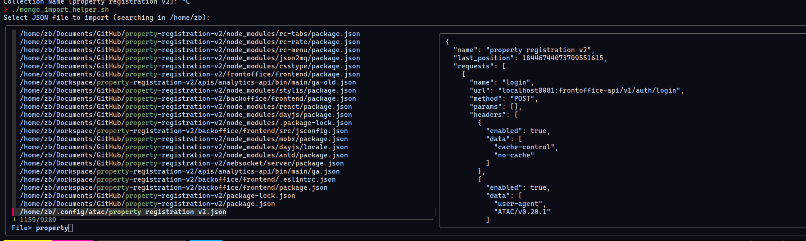
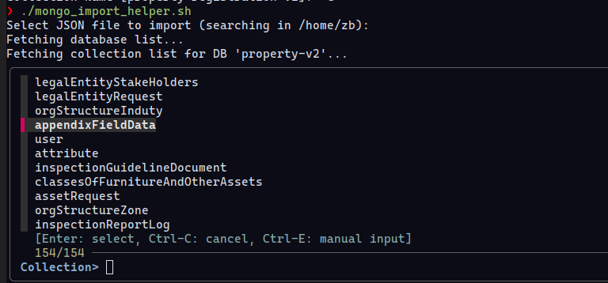

# MongoDB Импорт & Экспорт Туслагч Скриптүүд

Энэ репозиторид [`fzf`](https://github.com/junegunn/fzf) ашиглан интерактив байдлаар MongoDB өгөгдөл импортлох болон экспортлох үйл явцыг хялбарчлах хоёр Bash скрипт багтсан болно.

## 📜 Скриптүүд

---

### 1. `mongo_import_helper.sh`
`.json` файлуудыг MongoDB рүү импортлох интерактив туслагч.

#### Боломжууд
- `.json` файлыг сонгох интерактив файл сонгогч (`fzf`).

  

- Файлын нэр дээр үндэслэн анхдагч өгөгдлийн сан болон цуглуулгын нэрийг автоматаар санал болгоно:
  - Хэлбэр: `dbname.collection.json` → Өгөгдлийн сан = `dbname`, Цуглуулга = `collection`
  - Хэлбэр: `collection.json` → Өгөгдлийн сан хоосон (дараа нь сонгоно), Цуглуулга = `collection`
- MongoDB доторх байгаа өгөгдлийн сан болон цуглуулгыг интерактив байдлаар сонгох.

  

- Импортлохоос өмнө байгаа цуглуулгыг устгах эсэхийг сонгох боломжтой.
- `--jsonArray` тохиргоотой `mongoimport` ашиглан өгөгдлийг импортлоно.
- Импорт хийсний дараа нийт бичлэгийн тоог харуулна.

#### Ашиглах заавар
```bash
./mongo_import_helper.sh
```

### 2. `mongo_exporter.sh`
MongoDB-ийн өгөгдлийн сан эсвэл тодорхой цуглуулгыг экспортлох интерактив туслагч.

#### Боломжууд
- `fzf` ашиглан өгөгдлийн санг интерактив байдлаар сонгох.
- Бүх өгөгдлийн сан эсвэл зөвхөн нэг цуглуулгыг сонгон экспортлох.
- Экспортын файлуудыг цагийн тэмдэглэгээтэй хавтсанд дараах хэлбэрээр хадгална:
  - Өгөгдлийн сан: `./dump-<dbname>-<timestamp>/`
  - Цуглуулга: `./dump-<dbname>-<collection>-<timestamp>/`
- `mongodump` ашиглан BSON форматтайгаар экспорт хийнэ.

  


#### Ашиглах заавар
```bash
./mongo_exporter.sh
```


## ⚙ Шаардлагатай хэрэгслүүд суулгасан эсэхийг шалгах
```bash
command -v mongosh mongoimport mongodump fzf
```

### 🛠 Системд хэрэгслүүдийг суулгах

Скриптүүдийг ажиллуулахын тулд доорх хэрэгслүүд таны системд суусан байх шаардлагатай:

- `mongosh` – MongoDB Shell, өгөгдлийн сантай холбогдоход ашиглана.
- `mongoimport` – JSON файлыг MongoDB рүү импортлоход ашиглана.
- `mongodump` – MongoDB өгөгдлийг BSON форматтай экспортлоход ашиглана.
- `fzf` – Командын мөрөнд интерактив хайлт, сонголт хийх хэрэгсэл.

#### Ubuntu / Debian
```bash
sudo apt update
sudo apt install -y mongodb-clients mongodb-database-tools fzf
```


#### Arch Linux
```bash
sudo pacman -Syu mongodb-tools fzf
```


#### macOS (Homebrew ашиглан)
```bash
sudo pacman -Syu mongodb-tools fzf
```


